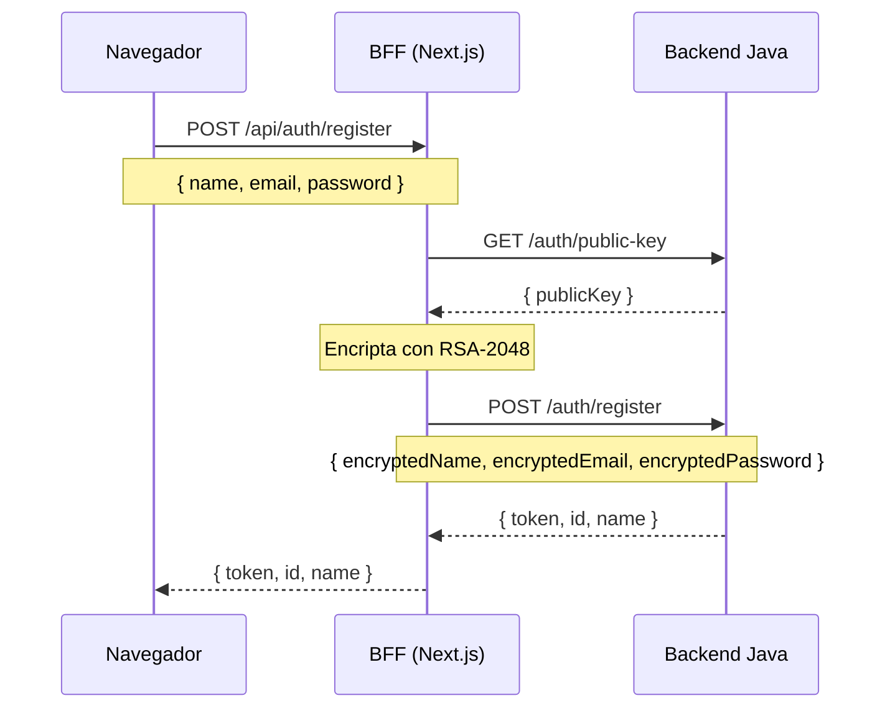
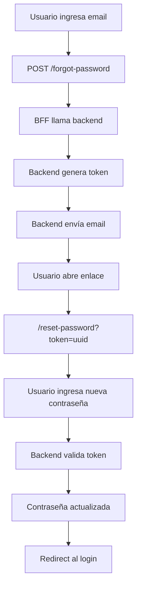
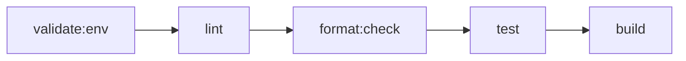

<div align="center">


# FinanzIA — Frontend

**Interfaz conversacional · BFF · Orquestación de IA**

*Donde el usuario vive la experiencia. Donde la seguridad empieza.*

</div>

---

## Responsabilidad

Este repositorio tiene dos roles simultáneos e inseparables:

### Interfaz de usuario

La experiencia conversacional que el usuario ve y usa. Chat-first, diseño premium "The Intelligent Curator", autenticación completa con registro y recuperación de contraseña.

### BFF (Backend For Frontend)

Una capa de servidor implementada como API Routes de Next.js que:

- Gestiona el JWT del usuario.
- Encripta credenciales con RSA antes de enviarlas al backend Java.
- Actúa como proxy seguro entre el navegador y los servicios backend.

Ninguna clave de API, token de autenticación ni endpoint del backend llega al navegador del usuario final.

---

## Stack tecnológico

| Capa | Tecnología | Versión |
| --- | --- | --- |
| Framework | Next.js App Router | 16.x |
| UI | React | 19 |
| Lenguaje | TypeScript strict mode | 5 |
| Estilos | Tailwind CSS | v4 |
| Componentes UI | Shadcn UI + Base UI | — |
| Validación de formularios | Zod | 4.x |
| Animaciones | Framer Motion | 12.x |
| SDK del agente IA | `@langchain/langgraph-sdk` | 1.x |
| Renderizado markdown | `react-markdown` | 10.x |
| Testing | Vitest + Testing Library | — |
| Calidad de código | ESLint · Prettier · Husky · commitlint | — |
| Despliegue | Vercel | — |

---

## Inicio rápido

### Prerrequisitos

- Node.js 22+
- npm
- Backend Java corriendo localmente

Repositorio backend:

```text
https://github.com/Proyecto-final-4/backend
```

### Configuración local

```bash
# 1. Clonar el repositorio
git clone https://github.com/Proyecto-final-4/frontend.git
cd frontend

# 2. Instalar dependencias
npm install

# 3. Configurar variables de entorno
cp .env.example .env.local

# Editar .env.local:
# BACKEND_JAVA_ENDPOINT=http://localhost:8080
# OPENAI_API_KEY=sk-...

# 4. Iniciar servidor de desarrollo
npm run dev
```

La aplicación queda disponible en:

```text
http://localhost:3000
```

---

## Scripts disponibles

| Comando | Descripción |
| --- | --- |
| `npm run dev` | Servidor de desarrollo con hot reload |
| `npm run build` | Build de producción con verificación TypeScript completa |
| `npm run start` | Servidor de producción |
| `npm run lint` | ESLint — debe salir con 0 errores |
| `npm run format` | Prettier — auto-formatea archivos |
| `npm run format:check` | Verifica formato sin modificar |
| `npm run test` | Vitest modo CI |
| `npm run test:watch` | Vitest modo watch |
| `npm run validate:env` | Verifica variables requeridas |

---

## Estructura del proyecto

```text
frontend/
│
├── app/
│   ├── (auth)/
│   │   ├── login/
│   │   ├── register/
│   │   ├── forgot-password/
│   │   └── reset-password/
│   │
│   ├── (dashboard)/
│   │   ├── transactions/
│   │   ├── categories/
│   │   ├── budgets/
│   │   ├── goals/
│   │   └── ai/
│   │
│   └── api/
│       ├── auth/
│       │   ├── login/route.ts
│       │   ├── register/route.ts
│       │   ├── forgot-password/route.ts
│       │   └── reset-password/route.ts
│       ├── users/me/route.ts
│       ├── transactions/route.ts
│       ├── categories/route.ts
│       ├── summary/route.ts
│       ├── rag/route.ts
│       └── ai/chat/route.ts
│
├── components/
│   ├── ui/
│   ├── layout/
│   ├── features/
│   │   ├── auth/
│   │   ├── transactions/
│   │   ├── categories/
│   │   ├── budgets/
│   │   ├── goals/
│   │   └── ai/
│   └── shared/
│
├── hooks/
│   ├── use-auth.ts
│   ├── use-transactions.ts
│   ├── use-categories.ts
│   └── ...
│
├── sdk/
│   ├── auth.ts
│   ├── transactions.ts
│   ├── categories.ts
│   ├── summary.ts
│   └── rag.ts
│
├── types/
│   ├── auth.ts
│   ├── transaction.ts
│   ├── category.ts
│   ├── budget.ts
│   └── savings-goal.ts
│
├── shared/
│   ├── constants/
│   └── utils/
│
└── workflows/
    ├── agents/
    └── tools/
```

---

## Patrón de consistencia por dominio

Cada dominio sigue exactamente la misma cadena de capas:

```text
types/transaction.ts
         ↓
sdk/transactions.ts
         ↓
hooks/use-transactions.ts
         ↓
components/features/transactions/
         ↓
app/(dashboard)/transactions/
         ↓
app/api/transactions/route.ts
```

Este patrón se aplica a:

- `auth`
- `transactions`
- `categories`
- `budgets`
- `goals`

---

## Rol del BFF y flujo de seguridad

El navegador nunca recibe ni gestiona directamente:

- JWT del usuario autenticado
- Clave de OpenAI
- Endpoint del backend Java
- Claves RSA

Todo vive exclusivamente en el servidor de Next.js gracias al patrón de API Routes.

---

## Flujo de registro con RSA



---

## Flujo de recuperación de contraseña



---

## Sistema de diseño — The Intelligent Curator

La filosofía visual es:

> “La interfaz no presenta datos, los distila.”

---

## Principios fundamentales

### Regla sin bordes

Las separaciones entre secciones se hacen exclusivamente mediante cambios de superficie.

Nunca usar:

```css
border: 1px solid;
```

### Jerarquía tonal

| Elemento | Token |
| --- | --- |
| Fondo principal | `surface` |
| Sidebar | `surface_container_low` |
| Cards | `surface_container` |
| Usuario IA | `primary_container` |
| Modales | `surface_lowest` + blur |

### Tipografía

| Uso | Fuente |
| --- | --- |
| Headlines | Manrope |
| Texto | Inter |

### Sombras

```css
box-shadow: 0px 12px 32px rgba(0, 70, 74, 0.06);
```

### Animaciones

```css
cubic-bezier(0.4, 0, 0.2, 1)
```

---

## CI/CD

Pipeline de GitHub Actions:



### Validaciones

| Paso | Qué valida |
| --- | --- |
| `validate:env` | Variables requeridas |
| `lint` | ESLint sin errores |
| `format:check` | Prettier sin diferencias |
| `test` | Todos los tests pasan |
| `build` | `next build` sin errores |

El deploy a Vercel ocurre automáticamente al hacer merge a `main`.

---

## Commits y hooks

Husky gestiona dos hooks:

### pre-commit

Bloquea commits si detecta:

- Claves OpenAI
- Errores ESLint
- Archivos sin formato

### commit-msg

Valida formato Conventional Commits.

### Ejemplos válidos

```bash
git commit -m "feat(auth): add forgot password flow with email recovery"

git commit -m "fix(transactions): handle null category in transaction list"

git commit -m "chore(deps): update next to 16.2.1"
```

### Prefijos permitidos

- `feat`
- `fix`
- `docs`
- `style`
- `refactor`
- `perf`
- `test`
- `build`
- `ci`
- `chore`
- `revert`

---

## Variables de entorno

| Variable | Scope | Requerida | Descripción |
| --- | --- | --- |---|
| `BACKEND_JAVA_ENDPOINT` | Server-side only | ✅ Sí | URL completa backend Java |
| `OPENAI_API_KEY` | Server-side only | ✅ Sí | Clave OpenAI para LangGraph |

Ambas variables son exclusivamente server-side y nunca llegan al navegador gracias a Next.js.
